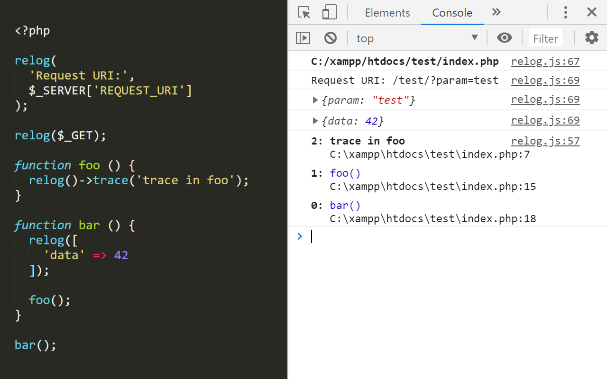
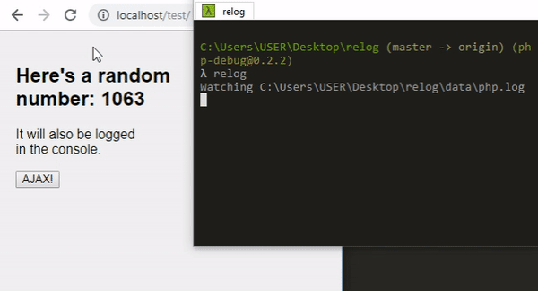
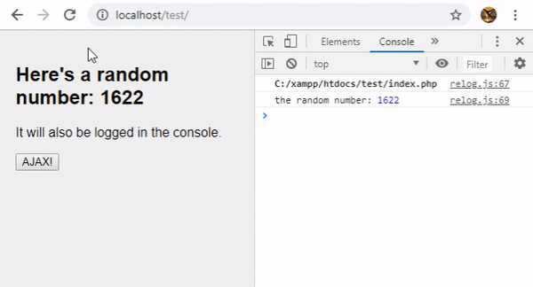
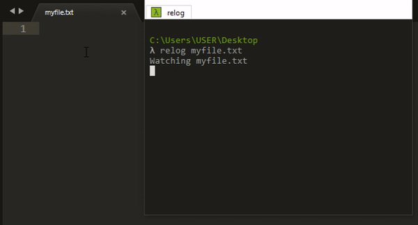
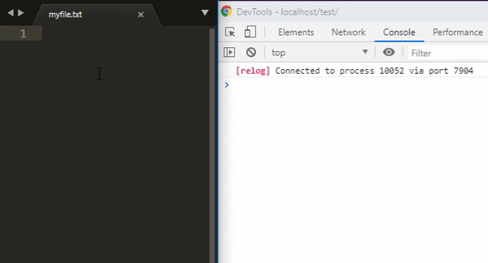
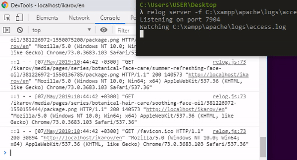

# relog

Lets you log and trace from PHP and stream the data to your terminal or the browser console. It can also be attached to any logfile and stream that instead.



## Installation

Make sure you have [Node.js](https://nodejs.org/) and [npm](https://www.npmjs.com/) installed. Then, install relog globally via npm:

```
npm i -g relog
```

If everything was successful, you should be able to run:

```
relog -h
```

...and see usage information.

**Note:** On Windows, `relog` might run the Microsoft [`relog`](https://docs.microsoft.com/en-us/windows-server/administration/windows-commands/relog) program. In that case, use `node-relog` instead of `relog` to run this program. Or, you can locate the Microsoft relog program and rename it, so that there's no name conflict.

### PHP Setup

To use the logging functions in PHP, you need to modify your _php.ini_ so that the relog PHP loader is included. Find your _php.ini_ and open it. Learn how to find its location [here](https://stackoverflow.com/a/8684638/3130281).

1. In _php.ini_, find this section of the file:

    ```ini
    ; Automatically add files before PHP document.
    ; http://php.net/auto-prepend-file
    auto_prepend_file=
    ```

2. Run the `loader` command of relog to get the PHP loader filepath. Copy it:

    ```
    relog loader
    C:\Users\USER\AppData\Roaming\npm\node_modules\php-debug\loaders\php\index.php
    ```

3. Paste that filepath in your _php.ini_:

    ```ini
    ; Automatically add files before PHP document.
    ; http://php.net/auto-prepend-file
    auto_prepend_file=C:\Users\USER\AppData\Roaming\npm\node_modules\php-debug\loaders\php\index.php
    ```

4. Restart the PHP server for changes to take effect.

## Usage

In your shell, run the logger with:

```
relog
```

In a PHP script, add:

```php
relog('test', 42);
```

Open that PHP script in your browser and check if the log appears in your shell.



### DevTools Extension

To stream the logs to your Chrome DevTools instead of your shell:

1. Install the [relog extension](https://chrome.google.com/webstore/detail/relog/pdnfjolnfbmlmncgkjphobojiglpcpic).

2. Run:

    ```
    relog server
    ```

3. Open DevTools in Chrome.

4. Refresh the page. New logs should appear in the console.

    

The PHP Logger adds `X-Relog` to the executed script's response headers. It contains an ID that is added to the metadata of all logs generated by that script execution. Later, the browser extension is able to read the headers and find which logs belong to which request and therefore, to which tab. This way, the logs for all requests generated by a certain tab appear in that tab's DevTools window.

### Arbitrary Files

You can make relog watch any file for changes. Simply run:

```
relog myfile.txt
```



The logs in your file can also be streamed to DevTools:

```
relog server -f myfile.txt
```



This can be useful if you want to watch other log files like the Apache _error.log_ or _access.log_:



## PHP API

### `relog(...$args)`

Logs everything you pass to the function. Objects are serialized, meaning that they are converted to arrays so that you can see all their data. If an argument is a function, that function's output is stored in an output buffer and the log contains the contents:

```php
relog('test', ['data' => 42], function () {
  echo 'echoing';
});
```

Log:

```
test { data: 42 } echoing
```

### `relog()`

If no arguments are passed to the `relog()` function, the relog Logger instance is returned so you can call _its_ methods.

### `relog()->log(...$args)`

Same as `relog(...$args)`.

### `relog()->dump(...$args)`

Invokes `var_dump()` on all arguments, stores the output in a buffer, and logs it.

### `relog()->trace([$name])`

Generates a backtrace with an optional name. If the log is streamed to DevTools, it will be nicely formatted.
